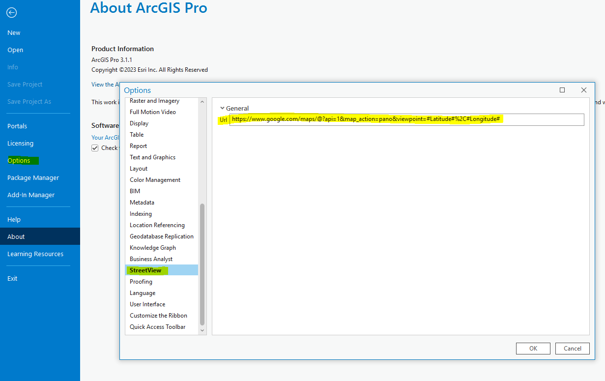

# ArcGIS Pro StreetView Addin

Set in Options -> StreetView -> Url

Placeholder: #Longitude#, #Latitude#, #Width# (optional), #Height# (optional)

Example:

https://www.mysite.com/panoAvailable.html?lat=#Latitude#&long=#Longitude#&width=#Width#&Height=#Height#

(if you host panoAvailable.html set your key in html)

https://www.google.com/maps/@?api=1&map_action=pano&viewpoint=#Latitude#%2C#Longitude#

## Requirements
- ArcGIS Pro 3.1
- Supported platforms
	- Windows 11 (Home, Pro, Enterprise)
	- Windows 10 (Home, Pro, Enterprise) (64 bit)
- Supported .NET
    - Microsoft .NET Runtime 6.0.5 or higher. Download .NET 6.0
- Supported IDEs
	- Visual Studio 2022 (v17.2 or higher)
		- Community Edition
		- Professional Edition
		- Enterprise Edition
